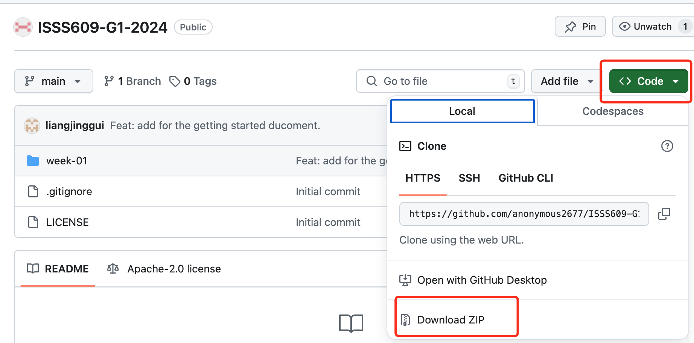

# 1.1 Getting Started

## Setting Up the Dev Environment

### Python/Conda

For in-class activities and homework, we will be using Python. Please ensure you have Python installed and can run a Python program. One of the simplest ways to install Python is through Conda, which provides both Python and a package manager.

Please download the minimal installer for Conda for your operating system from [this GitHub page](https://github.com/conda-forge/miniforge). Follow the installation instructions provided by the installer.

### Vscode

While you can choose any development environment, Vscode is also recommended. It is an Integrated Development Environment (IDE) suitable for using Python. You can find the installation resources on the [Vscode Website](https://code.visualstudio.com/). Follow the installation instructions provided by the installer.

### Google Colab

In addition to utilizing offline tools, you can also leverage openly available online tools for coding and analysis. Google Colab is a free cloud platform that allows you to write, execute, and share Python code through your browser. This tool is particularly suitable for learning and applying machine learning and data analysis.

Google Colab requires no installation, just a Google account to get started. You can easily begin your projects by visiting the [Google Colab website](https://colab.research.google.com/). Colab offers free GPU and TPU support, which can significantly speed up computations, especially when dealing with complex datasets and models.


## In-class Assignment Code Repository

The in-class assignments will be using sample code throughout the course, which you can find in the following GitHub repository: ISSS609-G1-2024. To access the code, you have two options:

**1. Clone the Repository (Recommended):** If you're familiar with Git, you can clone the repository to your local machine using the following command:

```shell
git clone https://github.com/anonymous2677/ISSS609-G1-2024.git
```


**2. Download as a Zip File:** If you're unfamiliar with Git or prefer not to use it, you can download the entire repository as a Zip file. Navigate to the repository's page and look for the 'Download ZIP' option, usually found under the green "Code" button.





## Running Example Code

After cloning or downloading the code above, navigate to the directory. Then run the following command to install the dependencies.

```shell
pip install -r requirements.txt
```

## Excercise 1. Introduction to Python

To get familiar with some basics of Python programming, try to write a short Python script for a guessing game. The script should:

- Pose a question: "Guess what I ate today for lunch!" and print it out the console.
- List choices of what you ate (e.g., “A: Pizza, B: Burger, C: Salad”)
- Implement a loop to allow option selection (A, B, or C):
    - If correct, output "You are right!" and exit the loop.
    - If incorrect, output "Try again!" and continue looping.
- Test the game with your classmates!

The script should look like below. The below template can also be found at **Introduction to Python** of [the course GitHub repo](https://github.com/anonymous2677/ISSS609-G1-2024/blob/main/week-01/01_gettting_started.ipynb).

```python
if __name__ == "__main__":
    # 1. Ask a question by printing "Guess what I ate today for lunch!" to the standard output.

    # 2. Provide options A, B, and C. (e.g., A: Pizza, B: Burger, C: Salad) by printing them to the standard output.

    # 3. In a loop, prompt the user to select option A, B, or C.
    # 3.1. If the user input is correct, print "You are right!" to the standard output and break the loop.
    # 3.2. If the user input is incorrect, print "Try again!" to the standard output.


    # 4. Play the game with your partners!
    pass
```

## Excercise 2. Introduction to NLTK

To get familiar with some data structures and functions within NLTK, try to write a short Python script for processing some text data and visualize it. The script should:

- Use the basic function of NLTK to analyze the work distribution of this text data and visualize it.
- Use the basic function of NLTK to remove some stopwords and re-calculate the distribution of this text data and visualize it.
- Change the text sources used in this script.
    - SMU web: https://www.smu.edu.sg/
    - SCIS MITB web: https://masters.smu.edu.sg/programme/master-of-it-in-business#programmeDetails-tab
    - NLTK web: https://www.nltk.org/

The script can be found at the **Introduction to NLTK** of [the course GitHub repo](https://github.com/anonymous2677/ISSS609-G1-2024/blob/main/week-01/01_gettting_started.ipynb).